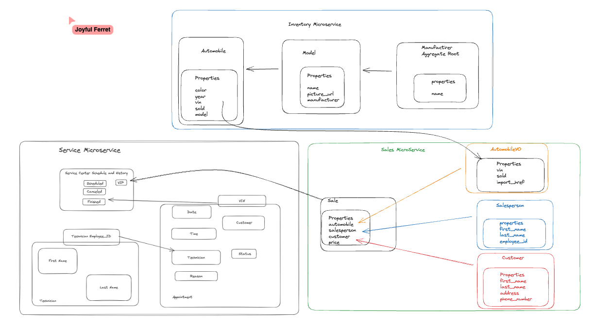

# CarCar

Team:

* Person 1 - Zach - Service
* Person 2 - Abraham - Sales

## Design

## Service microservice

We created three models for this microservice. Technician, Appointment, and AutomobileVO.
In the technician model we made sure to create the employee id field as a unique field so that each employee can be tracked by this id and not have an issues with the same id #.
AutomobileVO model was made to to get automobile info from inventory if needed.(I ended up making the app without ever having to access inventory directly, but indirectly it is accessed by the sales side, and im getting data from sales to populate vlues like VIP and sold on the automobile list and service appointments/service history)
Appointment model was made with properties to allow anyone, not just someone who has purchased a car from us, create an appointment with our service center. We did set status to default to scheduled, so it will show up on the eservice appointment list, then from there you can either cancel or finish it, but all three status's will show up on service history list.

We mainly used just the technician model and appointment model to make the front and back ends of the SPA.
The technician model was used to be able to create a technician, and to create an appointment with a specific technician, given as an option in the drop down. Once the appointment was created, you can access that technician through the appointment properties. There is also a functionality to delete a technician, but this will have to be done through Insomnia, as there was no requirement to have a delete option show up anywhere in the browser.
The Appointment model was used to create, list, and cancel or finish appointments. The cacnel and finish view functions would never delete an appointment but rather move it to a different end point that would set the status to either finished or canceled.

Then when it came to the VIP treatment, meaning the appointment was for a car that we sold, we called the sales list endpoint and got all those VINs and if the appointment VIN matched a sales vin then the car would be registered as a VIP.

## Sales microservice

The Sales microservice uses 4 models: Sale, Salesperson, Customer, and AutomobileVO. The fields for the Sale model are automobile, which is a foreign key field to the AutomobileVO model, the salesperson which is a foreign key field to the Salesperson model, the customer which is a foreign key field to the Customer, model, and also the price field. The fields represent a data needed to record a sale of an automobile. The fields for the Customer model were first_name, last_name, address, and phone_number. The fields represent the data needed to record a customer for the dealership, I also made the phone number a unique field to id a individual customer. The Salesperson model fields are first_name, last_name, and employee_id, with the employee_id being a unique field to id an indivdiual salesperson. The fields represent the data needed to record a salesperson for the dealership. The AutomobileVO model fields are vin, the vin being a automobile's VIN number, sold being either true or false if the car has been sold by the dealership, and the import_href being the href of the automobile url when the car was created in the inventory microservice.

The view functions in sales/api/sales_rest/views.py allow for the viewing of all sales, customers, salespeople, and the  creation of new sale, customer, and salespersons. The view function also allow for the deletion of the models: sale, customer, saleperson.

The integration the sales microservice has with the inventory microservice is with the use of a poller. The poller makes an api call to the inventory microservice which has all of the automobiles created, and every 60 second checks to see if any new automobiles were created or updated and will either create a new AutomobileVO or update the existing automobileVO in the sales microservice.
